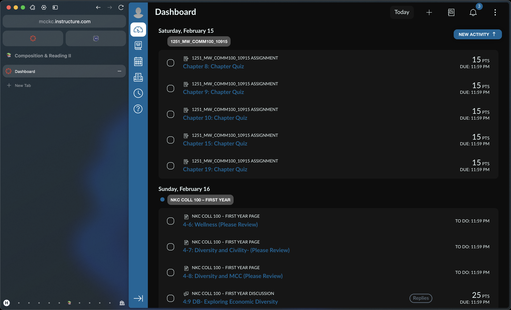

# Canvas Styling
A minimal stylesheet for [Canvas](https://www.instructure.com/) which takes theming into account while providing a modern and distraction-free interface so school doesn't have to feel so overwhelming.

<h2>Screenshots</h2>

  
  

# Installation
On most browsers, you may add this to any CSS user stylesheet. This stylesheet has been developed and tested with [Stylus](https://add0n.com/stylus.html).
- Install with [UserStyles](https://userstyles.world/style/20878/instructure-styles)
